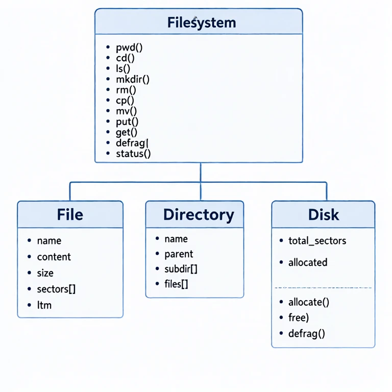
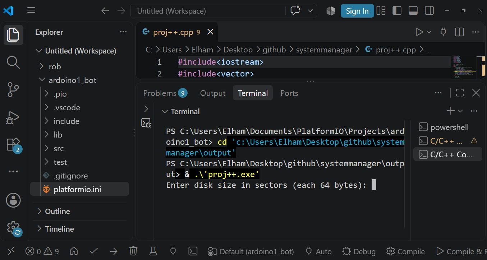

# 📁 Virtual File System Simulator

A C++ based virtual file system simulator that replicates how operating systems manage files, directories, and disk space. This project demonstrates core concepts of operating system design, including memory management, hierarchical structures, and disk allocation.


---

## 📋 Overview

A **virtual file system** implemented in C++ that simulates how operating systems manage files, directories, and disk space.

The project supports a wide range of file operations — including **copying, moving, deleting, and listing** files and directories — through an interactive command-line interface.

---

## 🚀 Key Features

- **Hierarchical File System:** Supports nested directories and files, managed via `parent` pointers.
- **Command-Line Interface (CLI):** Interactive shell to perform file operations.
- **Path Resolution:** Converts relative paths (e.g., `../docs`) to absolute paths efficiently.
- **Recursive Operations:** Handles recursive deletion and file management operations.
- **Sector Management:** Each file occupies one or more 64-byte sectors; implements efficient sector allocation/deallocation and defragmentation.

---

## 🏗️ Architecture



| Class | Responsibility |
| :--- | :--- |
| `File` | Stores file name, content, and allocated sectors. |
| `Directory` | Manages the tree structure (files + subdirectories). |
| `Disk` | Handles sector allocation, freeing, and defragmentation. |
| `FileSystem` | Main interface — parses commands and coordinates operations. |

---

## 🛠️ Commands

| Command | Description |
| :--- | :--- |
| `pwd` | Print current directory |
| `cd <path>` | Change directory |
| `ls [path]` | List files and directories |
| `mkdir <path>` | Create a new directory |
| `rm [-r] <path>` | Remove file or directory |
| `cp <src> <dest>` | Copy file or directory |
| `mv <src> <dest>` | Move file or directory |
| `put <name> <path>` | Import a real file into the virtual FS |
| `get <virt_path>` | Export a virtual file to disk |
| `defrag` | Defragment the disk |
| `status` | Show disk allocation |
| `exit` | Exit the program |

---

## 💻 How to Run

### 1. Clone the repository

```bash
git clone https://github.com/Amir-moghaddas/VirtualFileSystem.git
cd VirtualFileSystem
```

### 2. Compile

```bash
g++ -std=c++17 -o fs_simulator src/proj++.cpp
```

### 3. Run

```bash
./fs_simulator
```

---

## 🧪 Example Session



```
Enter disk size in sectors (each 64 bytes): 100
user@virtualfs:~$ mkdir docs
user@virtualfs:~$ mkdir projects
user@virtualfs:~$ cd docs
user@virtualfs:/docs$ mkdir notes
user@virtualfs:/docs$ ls
notes/
user@virtualfs:/docs$ pwd
/docs
user@virtualfs:/docs$ status
Disk allocation: 0000000000...
user@virtualfs:/docs$ exit
Goodbye!
```

---

## 📚 What I Learned

- Object-oriented design in C++
- Memory management and sector allocation
- File system hierarchy (tree structure)
- Command parsing and input handling
- Defragmentation algorithms

---

## 🔮 Future Improvements

- [ ] Add file permissions (`chmod`)
- [ ] Support symbolic links
- [ ] Add journaling for crash recovery
- [ ] Implement a graphical interface

---

## 🛠️ Tech Stack

- **Language:** C++
- **Concepts:** Data Structures, Recursive Algorithms, System Simulation
- **Tools:** GCC, Git, Linux CLI

---

## 📄 License

MIT License — see [LICENSE](LICENSE) for details.

---

## 👤 Author

**Amir Moghaddas**
Computer Engineering Student | IoT & Robotics Enthusiast

- LinkedIn: [linkedin.com/in/amir-moghaddas-027990388](https://www.linkedin.com/in/amir-moghaddas-027990388)
- GitHub: [github.com/Amir-moghaddas](https://github.com/Amir-moghaddas)


```bash
git clone https://github.com/Amir-moghaddas/VirtualFileSystem.git
cd VirtualFileSystem
